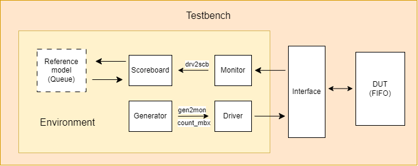

# FWFT FIFO Verification Environment

This project verifies a 32-bit, four-entry first-word fall-through (FWFT) FIFO with a lightweight class-based SystemVerilog testbench. The environment drives directed FIFO operations, monitors the DUT interface, predicts expected behavior with a queue-based reference model, and reports data or status-flag mismatches through a scoreboard.

The FIFO behavior documented here is provisional because an external RTL specification is not currently available. The reference model therefore captures the assumptions described below rather than copying the RTL implementation.

## Architecture



The physical `inf_fifo` interface is instantiated in `tb_top_fifo` and connected to the DUT. The environment receives a virtual-interface handle:

- The generator creates FIFO transactions and sends them to the driver.
- The driver applies active-low read, write, and clear controls through the interface.
- The monitor samples DUT inputs and outputs and forwards observed transactions to the scoreboard.
- The reference model uses a SystemVerilog queue to predict FIFO data and flags.
- The scoreboard compares monitored and predicted results, then prints a final summary.

## FIFO interface

### Inputs

| Signal | Description | Asserted value |
|---|---|---:|
| `Rst_N` | Asynchronous DUT reset | `0` |
| `FClrN` | Clear FIFO contents | `0` |
| `FInN` | Write request | `0` |
| `FOutN` | Read request | `0` |
| `Data_In[31:0]` | Input write data | — |

### Outputs

| Signal | Provisional interpretation | Asserted value |
|---|---|---:|
| `F_Data[31:0]` | Current first FIFO word | — |
| `F_EmptyN` | FIFO is empty | `0` |
| `F_FirstN` | At least one word is stored | `0` |
| `F_SLastN` | Two spaces remain | `0` |
| `F_LastN` | One space remains | `0` |
| `F_FullN` | FIFO is full | `0` |

For the four-entry FIFO, the reference-model flag table is:

| Occupancy | `F_EmptyN` | `F_FirstN` | `F_SLastN` | `F_LastN` | `F_FullN` |
|---:|---:|---:|---:|---:|---:|
| 0 | 0 | 1 | 1 | 1 | 1 |
| 1 | 1 | 0 | 1 | 1 | 1 |
| 2 | 1 | 0 | 0 | 1 | 1 |
| 3 | 1 | 0 | 1 | 0 | 1 |
| 4 | 1 | 0 | 1 | 1 | 0 |

## Reference-model assumptions

The queue model currently applies these rules:

- Clear or reset deletes every queued item.
- A write-only request is ignored when full.
- A read-only request is ignored when empty.
- Simultaneous read/write replaces the oldest item without changing occupancy.
- Simultaneous read/write while empty is treated as a no-op.
- `F_Data` is unspecified and is not compared while the modeled FIFO is empty.

Because the DUT is FWFT, writing the first word into an empty FIFO makes that word the expected `F_Data` without requiring a read request. When another word exists after a read, the next queued word becomes the expected output.

## Project layout

```text
fifo/
├── component/
│   ├── fifo_pkg.sv       # Operation and data-mode enumerations
│   ├── inf_fifo.sv       # DUT interface, clocking blocks, and modports
│   ├── trans_fifo.sv     # Stimulus and monitored transaction fields
│   ├── gen_fifo.sv       # Directed transaction generator
│   ├── driver_fifo.sv    # Interface driver
│   ├── monitor_fifo.sv   # Interface monitor
│   ├── fifo_model.sv     # Queue-based golden/reference model
│   ├── scb_fifo.sv       # Checker, comparison, logging, and summary
│   ├── env_fifo.sv       # Environment construction and execution
│   └── component.f       # Component compile order
├── rtl/
│   ├── fifo.v            # FIFO RTL
│   └── rtl.f
├── testbench/
│   ├── base_test.sv      # Base test and send helper
│   ├── tb_top_fifo.sv    # DUT/interface instantiation and test selection
│   ├── testbench.f       # Test compile order
│   └── *.sv              # Directed tests
├── sim/
│   ├── compile.f         # Top-level file list
│   └── makefile          # QuestaSim build/run commands
├── diagram.png
└── README.md
```

## Requirements

- A SystemVerilog-capable QuestaSim/ModelSim installation
- A valid simulator license
- GNU Make
- WSL when using the Makefile paths as currently written

The Makefile points to `/mnt/d/QuestaSim/win64`. Update `VLIB`, `VLOG`, and `VSIM` in `sim/makefile` if QuestaSim is installed elsewhere.

## Build and run

Run commands from the `sim` directory:

```sh
cd sim
make build
make run TESTNAME=single_rnw
```

Build and run in one command:

```sh
make all TESTNAME=multiple_rnw
```

Open the generated WLF waveform:

```sh
make wave
```

Clean generated simulation files:

```sh
make clean
```

## Available tests

| Test name | Main scenario |
|---|---|
| `base_test` | Environment startup with no generated traffic |
| `single_rnw` | Individual writes followed by an individual read |
| `multiple_rnw` | Fill the FIFO, then read every entry |
| `single_rw` | Individual simultaneous read/write operations |
| `multiple_rw` | Repeated simultaneous read/write operations |
| `read_empty` | Repeated reads while empty |
| `write_full` | Additional writes after reaching full |
| `rw_empty` | Simultaneous read/write while empty |
| `rw_full` | Simultaneous read/write while full, followed by reads |
| `firstn` | `F_FirstN` behavior around the first stored word |
| `slastn` | `F_SLastN` behavior around two remaining spaces |
| `lastn` | `F_LastN` behavior around one remaining space |
| `clr` | Standalone FIFO clear |
| `clr_read` | Clear asserted with read |
| `clr_write` | Clear asserted with write |
| `clr_rw` | Clear asserted with simultaneous read/write |

## Scoreboard output

By default, the scoreboard prints mismatch diagnostics and the final check summary. To display actual and expected data and all flags for every transaction, enable `DISPLAY_ALL` in `component/env_fifo.sv`:

```systemverilog
scb_fifo #(.DISPLAY_ALL(1'b1)) scb;
```

Set it back to `1'b0` for failure-only transaction logging.

## Reset scope

`Rst_N` is currently controlled by `tb_top_fifo`: reset is asserted during startup and released before directed traffic begins. The monitor records the interface reset value in each observed transaction, allowing the reference model to reset when required.

Mid-test reset generation and reset-recovery scenarios are not currently part of the test plan. This is a known verification limitation; `FClrN` tests validate FIFO clear behavior but do not replace asynchronous-reset verification.
